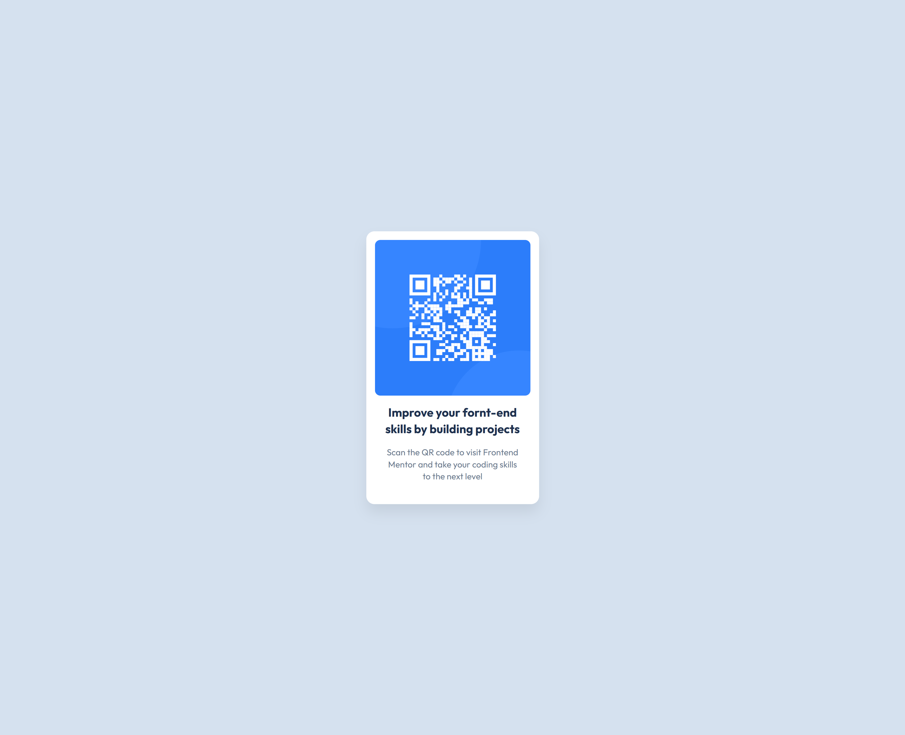

# Frontend Mentor - QR Code Component Solution

This is my solution to the [QR Code Component challenge on Frontend Mentor](https://www.frontendmentor.io/challenges/qr-code-component-iux_sIO_H).  
Frontend Mentor challenges help improve coding skills through building realistic projects.

---

## 📋 Table of Contents

- [Overview](#overview)
- [Screenshot](#screenshot)
- [Links](#links)
- [My Process](#my-process)
  - [Built With](#built-with)
  - [What I Learned](#what-i-learned)
  - [Continued Development](#continued-development)
- [Author](#author)
- [Acknowledgments](#acknowledgments)

---

## 🧩 Overview

This project is a QR Code Component designed to practice HTML, CSS, and Flexbox.  
It features a clean, responsive card layout displaying a QR code with descriptive text.

### Screenshot



**Key Features:**  
- Fully responsive card layout  
- Flexbox-based vertical and horizontal centering  
- Semantic HTML structure and reusable CSS variables  

**Goal:**  
Strengthen understanding of Flexbox, responsive design, and clean UI layout by building a realistic component.

---

## 🔗 Links

- **Solution URL:** [Frontend Mentor Solution](https://www.frontendmentor.io/solutions/qr-code-component-main)  
- **Live Site URL:** [Live Demo](https://satyanaryan-parida.github.io/qr-code-component-main/)

---

## 🧠 My Process

### Built With

- Semantic **HTML5** markup  
- **CSS custom properties** for maintainable color scheme  
- **Flexbox** for alignment and layout  
- Mobile-first workflow  
- Responsive design principles  

### What I Learned

This challenge enhanced my skills in:  

- Centering elements using Flexbox with `justify-content` and `align-items`  
- Creating reusable color variables using `:root`  
- Maintaining consistent spacing and typography with relative units and `gap`

Here’s a CSS snippet I’m proud of:

```
body {
  background-color: var(--Slate-300);
  font-family: "Outfit", sans-serif;
  display: flex;
  justify-content: center;
  align-items: center;
  min-height: 100vh;
}
```

This snippet ensures the `.card` component is perfectly centered across all screen sizes.

### Continued Development

Future goals include:  

- Exploring CSS Grid for advanced layouts  
- Adding subtle animations like fade-ins to boost interactivity  
- Increasing focus on accessibility, including alt text, semantic tags, and color contrast  

---

## 👨‍💻 Author

- Frontend Mentor - [@Satyanaryan-parida](https://www.frontendmentor.io/profile/Satyanaryan-parida)  
- GitHub - [@Satyanaryan-parida](https://github.com/Satyanaryan-parida)  

---

## 🏁 Acknowledgments

Thanks to **Frontend Mentor** for providing a clear, effective challenge to strengthen core HTML and CSS skills.
```